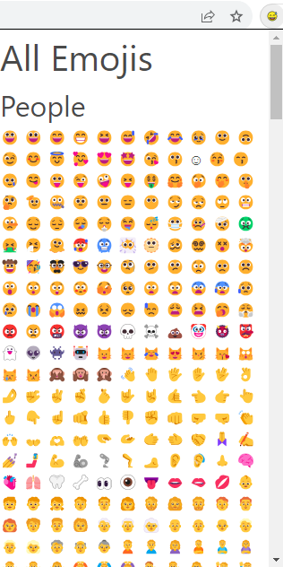
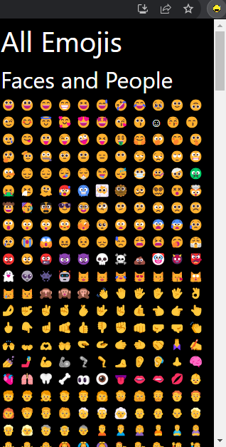

# All Emojis

Descripton:

This extension was published to the chrome store! check it out! https://chrome.google.com/webstore/detail/all-emojis/ldlgfkpggdihlemfgdnpbjlkenlifbfl?hl=en&gl=US&authuser=0&utm_source=gmail

Easy to use Chrome Extension allows you to copy and paste emojis without having to type anything in a search bar. 😻 Emojis are on a click away! 🫶

This app also features both light and dark mode, depending on the settings of your computer automatically. 🫥

Add emojis to email, social media including Facebook, anywhere with one click, and a copy and paste. 😆

No ads or trackers! 🙌 No user data collected! 😋

Made with ❤️ in the USA! 

# Light and Dark Mode

# Installation

# Download the project, use git clone <.git_link> or download as a zip through the code button and unzip.

# Go to Chrome based browser(Chrome, Brave, Vivaldi, etc.)

# go to extensions in setting menu

# you may need to click "developer mode" and turn it on.

# Click "load unpacked" and select the folder where the files are(the project)

# Extension installed, click puzzle piece and pin it for easy use. Then you can click the extension to open the menu. Enjoy!

Privacy Policy:

This app collect no user data.
