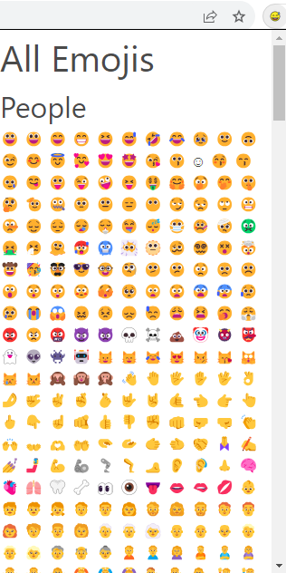

# All Emojis

# This chrome extension allows you to have emojis ready for copy and pasting by clicking it.

# Installation

# Download the project, use git clone <.git_link> or download as a zip through the code button and unzip.

# Go to Chrome based browser(Chrome, Brave, Vivaldi, etc.)

# go to extensions in setting menu

# you may need to click "developer mode" and turn it on.

# Click "load unpacked" and select the folder where the files are(the project)

# Extension installed, click puzzle piece and pin it for easy use. Then you can click the extension to open the menu. Enjoy!

Privary Policy:

This app collect no user data.
